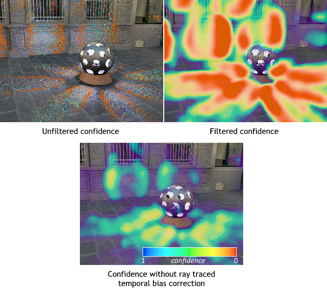

# Computing Denoiser Confidence Inputs using RTXDI

## Introduction

Modern denoisers, specifically those provided by the [NRD library](https://github.com/NVIDIAGameWorks/RayTracingDenoiser), are spatiotemporal filters. That means they accumulate lighting information over multiple frames in order to produce a stable output signal. While this approach is very effective for noise reduction, it has a major downside: the output signal often reacts to abrupt changes in the input relatively slowly. That can be seen as light turning on and off smoothly instead of instantly, shadows lagging behind the objects that cast them, and illumination from moving lights being smeared. The NRD denoisers include some heuristics to mitigate these effects, but they're only effective to some degree.

Fortunately, it is possible to provide external hints to the denoisers to tell them where scene lighting has changed, and therefore, where the accumulated history should be reset. NRD calls that the "confidence" inputs, and it's a screen-sized single-channel texture that has 1.0 where the lighting is stable and 0.0 where it's changed. There are two confidence channels, one for diffuse lighting and one for specular. The RTXDI sample application implements a fast and effective solution to compute the confidence channels using the light reservoir information and some ray tracing.

## Background

The confidence solution in RTXDI is inspired by the A-SVGF algorithm published in 2018 by C. Schied et al. in the paper called ["Gradient Estimation for Real-Time Adaptive Temporal Filtering"](https://cg.ivd.kit.edu/english/atf.php). In A-SVGF, the image is subdivided into 3x3 squares, or strata, and one pixel is selected from each stratum. That pixel is forward-projected from the previous frame to the current frame in order to create a "temporal gradient". The reprojection makes sure that no more than one temporal gradient ends up in every stratum of the current frame, and carries some parameters of the previous surface over to the current frame. The parameters include the random number seed used to shade this surface on the previous frame, and that allows the algorithm to shade the same surface in a way that is directly comparable with the previous frame. As a result, if the temporal gradient pixels produce the same shading output on the previous and current frames, the lighting in this area is considered valid; if the shading outputs are different, the lighting is invalid, and the denoiser history should be reset.

Notable open source implementations of A-SVGF can be found in the [Q2VKPT](http://brechpunkt.de/q2vkpt) project and its successor, [Quake II RTX](https://github.com/NVIDIA/Q2RTX). Q2VKPT implements the "vanilla" A-SVGF with forward projection of the surfaces from the previous frame into the current frame using the V-buffer; Q2RTX has switched to a different approach that is based on backward projection and G-buffer patching because the forward projection approach doesn't work for objects seen through reflections and refractions.

While A-SVGF worked well in these projects, it is not very practical for more complex renderers due to the fragility that comes from reusing random number sequences. Great care must be taken to avoid computing false positive gradients based on unrelated changes in the scene. For example, a change in the total light _count_ makes the light sampling logic select different lights using the same RNG sequence even though the surface being shaded may be unaffected by the change at all. In the case of RTXDI, reusing the RNG sequence doesn't look sufficient at all because the shading results depend on persistent state that is different from frame to frame, specifically the light reservoirs. Good news is, we can reuse the reservoirs instead of random numbers.

## Temporal Gradients in RTXDI

Similar to A-SVGF, we define a temporal gradient as difference between the shading results of the same surface using the same light sample on two consecutive frames. Gradients defined like this capture the changes in the surface's lighting environment, such as lights moving relative to the surface, lights changing their intensity, or lights becoming shadowed or un-shadowed. They may capture the difference in shading results due to the view vector changing because of camera motion, or not capture that, depending on the implementation; when using the NRD denoisers, capturing the view vector changes is not necessary. Gradients should **not** capture any changes due to the subpixel camera jitter that results in slight material variation in the same pixel when the camera is static.

Temporal gradients are computed using a separate compute or ray tracing pass that runs after final shading, [`ComputeGradients.hlsl`](../shaders/LightingPasses/ComputeGradients.hlsl). As a pre-requisite, the temporal resampling pass or the fused kernel saves the screen-space position of the pixel whose reservoir was used as the temporal light sample. Also, the luminance of the final shading results from the current and the previous frames needs to be available. Luminance can be computed from the diffuse and specular lighting textures if they store unmodified colors, but the RTXDI sample app may add BRDF ray tracing results into the same textures, so the sampled lighting luminance values are stored separately in the textures called `RestirLuminance`.

The gradient pass has two phases of execution:

1. One pixel is selected for gradient computation from the stratum. The current implementation just picks the pixel that has valid history and the highest luminance out of all pixels in the stratum on either the current or the previous frame. Other heuristics are possible, for example, stochastically selecting a pixel using the luminances as probability mass function values, but we have not observed any significant difference in gradient quality from using that. For the selected pixel, either the current or previous frame light sample is used, whichever is the brightest - and therefore, whichever is likely to produce the highest gradient value.

2. For the selected pixel, shading in the "other frame" is performed. This means, if we have selected a light sample from the current frame as reference, we'll take the current surface, reconstruct its position in the previous frame, and shade that reconstructed surface using the previous frame's light information and scene BVH. (**Note:** previous frame scene BVH is necessary here; if it's not available, only forward projection shading of the previous sample makes sense.) If we have selected a light sample from the previous frame, we'll take the previous surface, reconstruct its position in the current frame, and so on. Then the difference between the current and previous shading results is used as the gradient value.

For more details on the gradient pass implementation, please refer to the comments in `GradientsPass.hlsl`.

## Converting the Gradients into Confidence

The gradients pass produces a sparse and low-resolution signal, normally at 1/3 the screen resolution, that stores luminance differences and absolute values. Feeding that signal into the denoiser as confidence just wouldn't work, and the signal needs to be filtered and converted first.

First, the gradients are filtered spatially using a wide blur. The blur size and exact parameters may vary; the RTXDI sample app uses a 4-pass A-trous filter with a 3x3 kernel, which results in a 31 pixel kernel radius (in gradient space). The blur could be bilateral and take surface normals and positions into account, if desired. Our implementation is very straightforward and can be found in [`FilterGradientsPass.hlsl`](../shaders/FilterGradientsPass.hlsl). Note that the luminance differences and absolute values are filtered independently, which means that a small local change in a bright region is unlikely to result in history invalidation.

Second, the filtered gradients are normalized, i.e. luminance differences are divided by the absolute luminance values, and then converted into (0-1) confidence using a simple function. This signal can already be fed into the confidence input of the denoiser, but there is one extra trick.

The gradients are often noisy even after the spatial filtering, which sometimes results in patchy history invalidation. More importantly, singular events like a light turning on or off only create nonzero gradients on one frame. The spatiotemporal nature of ReSTIR leads to noisy and locally biased lighting on that first frame after a significant change. If the denoiser history is reset momentarily and then accumulation starts from scratch, that local bias has a significant weight in the history, resulting for example in a "black dip" effect around a light that has turned off.

The solution to both noisy confidence and local bias is simple: we can apply a short-history temporal filter to the confidence input of the denoiser. When the temporal filter is tuned right, deoniser history invalidations happen smoothly over a few frames and not abruptly. The temporal filter can be very simple; refer to [`ConfidencePass.hlsl`](../shaders/ConfidencePass.hlsl) for a reference implementation.

The images above illustrate the confidence channel computed from unfiltered gradients (top-left) and after spatial and temporal filtering (top-right) resulting from light coming through a rotating sphere with holes. The confidence is shown using a reverse heat map to highlight the regions where the history should be invalidated.

The bottom image above shows the importance of using ray traced bias correction in temporal resampling when computing gradients. When ray traced bias correction is not used, the ReSTIR lighting signal in regions with dynamic shadows is significantly dimmer, which results in smaller gradients and therefore higher computed confidence. Thus it is highly recommended to implement ray traced temporal bias correction.

In order to reduce the GPU workload resulting from this correction, we can use an important observation: most of the time, temporal resampling picks the sample from the previous frame. The correction traces a visibility ray between the previous frame surface and the selected light sample on the previous frame. This visibility has already been computed on the previous frame, so, if invisible samples are discarded in final shading, they cannot be selected in the temporal resampling part because they no longer exist. With this assumption, temporal resampling can skip tracing the visibility ray if the selected sample comes from the previous frame. In typical scenarios, that reduces the number of rays traced by over 90%. This optimization can be enabled using the `enableVisibilityShortcut` parameter in the `RTXDI_TemporalResamplingParameters` and `RTXDI_SpatioTemporalResamplingParameters` structures.
