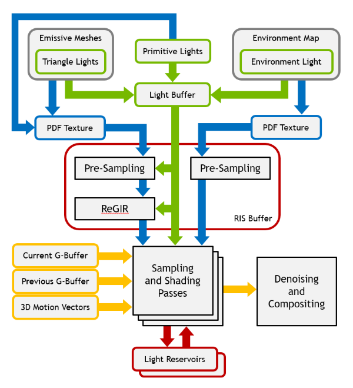
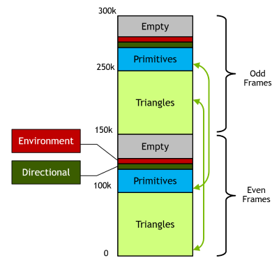
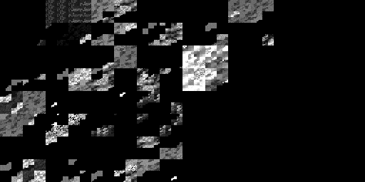
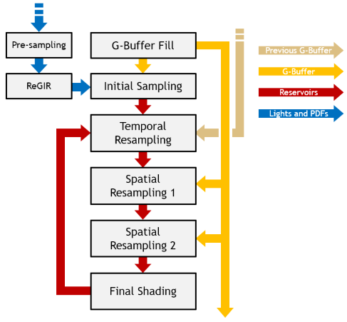
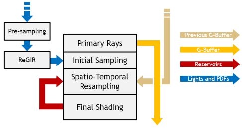
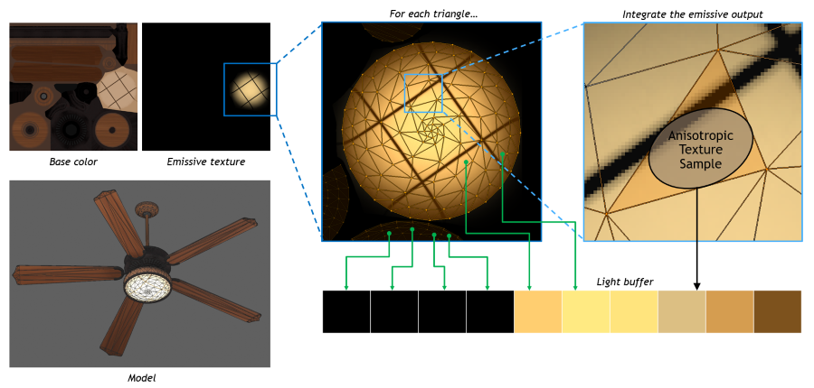
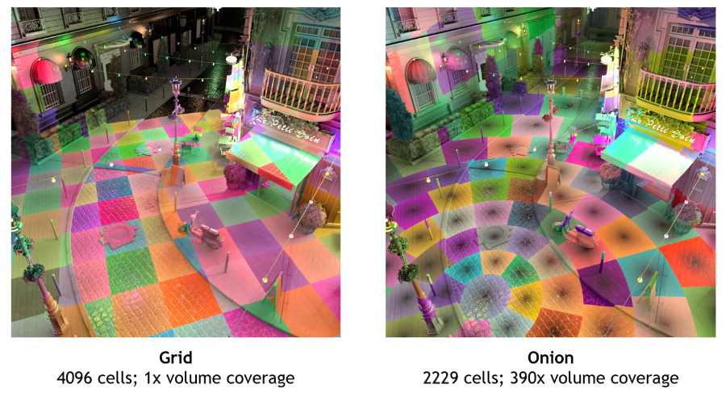
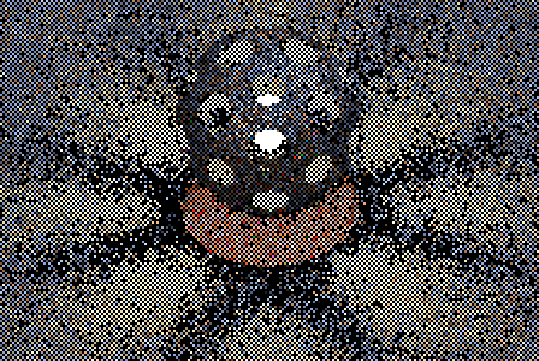

# Three Algorithms in One SDK

The RTXDI SDK originally contained a single algorithm, ReSTIR DI. Over time, however, the SDK has been expanded to include the ReGIR and ReSTIR GI algorithms. These three algorithms are grouped together because they all deal with importance sampling for path tracing. While something like "RTX IS" might therefore be a clearer name today, RTXDI is kept for historical continuity. Here is a summary of the three algorithms:

- ReSTIR DI, short for **Re**servoir **S**patio**T**emporal **I**mportance **R**esampling for **D**irect **I**llumination, is a screen space light sampling technique used for illuminating primary surfaces during path tracing. It cheaply selects several lights from an initial distribution, such as a uniform or power-based one, then selects one light of that group based on a more expensive distribution, such as one including geometry, BRDF, and visibility terms, and uses that one for illumination. These samples are then resampled over time and across neighboring pixels to increase effective sample count.
- ReGIR, short for Reservoir-based Grid Importance Sampling, is a world space light sampling technique that can be used for illuminating primary or subsequent surfaces. It samples lights from an initial distribution, such as a uniform or power-based one, for each grid cell. Other algorithms, such as ReSTIR DI and ReSTIR GI, can sample lights from this grid if the surface they are illuminating falls in a grid cell.
- ReSTIR GI, short for **Re**servoir **S**patio**T**emporal **I**mportance **R**esampling for **G**lobal **I**llumination, is a screen space light sampling technique used for illuminating secondary surfaces during path tracing. ReSTIR GI requires an initial light sampling technique be implemented by the path tracer for the secondary surface. In the `rtxdi-sample` project, this method is the initial sampling pass from ReSTIR DI, although any technique may be used. This secondary surface sample is then resampled across other pixels in space and time.

The algorithms in the SDK are implemented largely independent from one another, and the C++-side of each is centered around an accordingly named context class (`ReSTIRDIContext`, `ReGIRContext`, and `ReSTIRGIContext`). However, ReSTIR DI has a close integration of ReGIR for initial sampling. Likewise, the `rtxdi-sample` project uses ReSTIR DI's light sampling functions to illuminate secondary surfaces during multi-bounce path tracing.

The SDK also provides structs and functions that are shared between multiple algorithms. For example, the `RtxdiParameters.h` header provides structs relating to the light buffer and global runtime parameters. Likewise, the `PresamplingFunctions.hlsli` file provides presampling functions for creating PDF-textures for both local and environment lights, which can, in turn, be sampled from in the initial sampling passes of ReSTIR DI, ReGIR, and ReSTIR GI for improved sampling quality.

The SDK collects all three algorithm contexts and the shared state and functionality into a single `ImportanceSamplingContext` class. You can use this class as-is, or you can use it as a guide to cherry-pick the individual algorithm contexts and pieces of shared functionality from it that you want for your particular integration.

# Integrating RTXDI

The algorithms in the RTXDI SDK require a deep integration into the renderer. This method of integration is necessary because light sampling relies on several key pieces of functionality that are different in each renderer:

- Material model
- Scene data representation
- Ray tracing implementation
- G-buffer access
- Graphics API access

To avoid making overcomplicated abstractions or restrictive requirements, the RTXDI SDK follows an approach where the application is responsible for all of the above functionality, and RTXDI only provides the light sampling and resampling math that ties into pieces of that functionality through shader callback functions. This makes the integration process fairly involved, but the developers have complete control over the lighting system of their engines and do not have to ship any extra closed-source libraries with it.

The functionality provided by RTXDI can be separated into shader-side and host-side. Shader-side functionality for ReSTIR DI is provided through the [`DIResamplingFunctions.hlsli`](../rtxdi-sdk/include/rtxdi/DIResamplingFunctions.hlsli) include file and documented in [Shader API Reference](ShaderAPI.md). Host-side functionality is provided through the [`ReSTIRDI.h`](../rtxdi-sdk/include/rtxdi/ReSTIRDI.h) include file and the [`ReSTIRDI.cpp`](../rtxdi-sdk/src/ReSTIRDI.cpp) source file, which together form the `ReSTIRDIContext` class. ReGIR's context lives in [`ReGIR.h`](../rtxdi-sdk/include/rtxdi/ReGIR.h), and ReSTIR GI's context lives in [`ReSTIRGI.h`](../rtxdi-sdk/include/rtxdi/ReSTIRGI.h) Functionality that is shared between these algorithms is located in [`RtxdiUtils.h`](../rtxdi-sdk/include/rtxdi/RtxdiUtils.h).

The application also needs to provide shader-side and host-side functionality for RTXDI to work. Most importantly, it needs to provide the bridge structures functions, or callbacks, that are used by the RTXDI resampling functions. Those functions' and structures' names start with `RAB_` (for "**R**TXDI-**A**pplication **B**ridge"). For the complete list of functions and structures that need to be implemented, see the [Bridge Reference](RtxdiApplicationBridge.md). Then the application needs to assemble the resampling functions into complete shaders to build the desired pipeline and compile those shaders. Finally, at run time, the application needs to collect the light information, create the necessary buffers, and execute the compiled shaders.

For additional considerations about the necessary passes and functions, and to learn more about noise and bias reduction, see the [Noise and Bias Guide](NoiseAndBias.md).

## Frame rendering sequence

The data flow of a renderer using RTXDI is shown on the diagram below.

The rendering process includes the following steps.

### 1. Allocate resources (Once)

The application needs to allocate all resources used by RTXDI, because the RTXDI library code does not do any graphics API interaction. To make that process easier, the SDK provides a few functions to compute the right sizes of those resources. See [`RtxdiResources.cpp`](../src/RtxdiResources.cpp) for an example.

The following resources are used by RTXDI sampling and resampling functions, either directly or through the bridge:

- *Light data buffer*: stores information about all lights in the scene. See the [next section](#lightbuffer) to learn more about this buffer.
- *Light index mapping buffer*: stores the mapping of light indices from the previous frame to the current frame and the other way around.
- *Neighbor offset buffer*: stores random pixel offsets for spatial resampling. Initialize using `rtxdi::FillNeighborOffsetBuffer` at creation.
- *PDF (Probability Density Function) textures*: these textures store the probability for each light or each environment map pixel being sampled. See the [PDF texture section](#pdf-textures) for more information.
- *RIS (Resampled Importance Sampling) buffer*: stores results of pre-sampling passes. Each element of the RIS buffer is a `uint2` where the `.x` component stores the light index, and the `.y` component stores the inverse of its selection PDF.
- *RIS light data buffer*: stores information about the lights in each element of the RIS buffer. This buffer is optional and its only purpose is to improve performance by making memory accesses more local in the initial sampling pass.
- *Reservoir buffer*: contains several screen-sized arrays storing one `RTXDI_PackedDIReservoir` structure per pixel each. The number of these arrays is determined by the complexity of the application's resampling pipeline, and the number of final samples per pixel. For a simple use case when the application is doing spatiotemporal resampling with one spatial pass and one sample per pixel, two arrays are sufficient. To compute the array size, use the `rtxdi::ReSTIRDIContext::getReservoirBufferParameters().reservoirArrayPitch` field and not just the product of screen width and height, because the pixels are stored in the buffer in a block-linear layout.

These buffers are created by the sample application but are not used by RTXDI, they are only necessary to prepare the light buffer:

- *Task buffer*: stores information about emissive meshes and primitive lights, and their location in the light buffer. This buffer drives the execution of the `PrepareLights` shader.
- *Primitive light buffer*: stores the primitive light data that is copied to the right location in the light buffer.

###  2. Prepare the light buffer

Collect information about all lights in the scene into a buffer. That includes mesh lights, primitive lights, and the environment map.

- *Mesh lights* (aka emissive meshes) need to be broken down into triangles, so that each emissive triangle becomes a separate light. See [below](#meshlight) for additional information on mesh processing.
- *Primitive lights*, such as spheres, disks, directional lights, or dome lights need to be represented in a polymorphic fashion, so that they can all be stored in the same structure, `RAB_LightInfo`. Triangle lights also need to be polymorphic. **NOTE:** Triangles and any lights that have a position and finite power are called "local" lights in RTXDI; directional lights and domes are called "infinite" lights.
- *Environment map* can be importance sampled, in which case it must be represented with a single light in the light buffer, and it must have a PDF texture.
- The information about the numbers of lights of each type and their placement in the buffer is provided to RTXDI through the `RTXDI_LightBufferParameters` structure.

The layout of the light buffer used in the sample application is shown here:

Note that there are two groups of lights here, one for the odd frames and one for the even frames. This ensures that temporal resampling can access light information from the previous frame, which is necessary to compute the correct normalization factors for unbiased resampling. Another necessary thing is the mapping between light indices on the current and previous frames, which is provided through the [`RAB_TranslateLightIndex`](RtxdiApplicationBridge.md#rab_translatelightindex) bridge function.

Also note that this layout is only an example, and integrations can choose to use different layouts. One example would be using two buffers to store the current and previous light data and distinguish between them using the `previousFrame` flag passed to `RAB_LoadLightInfo`. Another example is using higher bits of the light index to differentiate between various light classes, like using one address range for local lights and a special index for the environment light.

###  3. Build PDF textures (Optional)

In order to use importance sampling for local lights and the environment map, their PDF textures and their mipmaps need to be built. For local lights, the PDF texture is just a 2D texture with power-of-2 dimensions (width 2x greater than height if necessary) that has enough pixels to allocate one pixel per light. The lights are mapped to pixels using the Z-curve, i.e. `pdfTexturePosition = RTXDI_LinearIndexToZCurve(localLightIndex)`. For the environment map, the PDF texture should map to the actual environment map 1:1, with its pixels containing *luminance * pixelSolidAngle*, non-normalized. Local light PDF likely needs to be updated on every frame, if any lights change their intensities. Environment map PDF only needs to be updated when the environment map changes.

The local light PDF texture might look like this image:

The PDF texture also needs to have a full mip chain, up to 1x1 pixels. Any mipmap generation code can be used, as long as it does exactly 4:1 pixel downsampling in each step using a box filter: *output = sum(inputs) / 4*.

In the sample application, the first pass of PDF texture build for local lights is happening in the `PrepareLights` pass, which computes the lights' power values and stores them into the texture. The first pass of PDF texture build for the environment map is fused into the `GenerateMips` pass.

### 4. Fill the constant buffer structure

Each pass of the ReSTIR DI algorithm requires settings from a correspondingly named `ReSTIRDI_*Parameters` struct. Fetch these from the ReSTIRDI context by calling the appropriate `rtxdi::ReSTIRDIContext::get*()` functions and place them into a constant buffer. Additionally, some settings are shared between stages and are stored in the `rtxdi::ReSTIRDIContext::getRuntimeParams()`, `rtxdi::ReSTIRDIContext::getBufferIndices()`, and `rtxdi::ReSTIRDIContext::getReservoirBufferParameters()` functions; these, too, must be stored in the constant buffer for each pass of the algorithm and passed to the shader functions accordingly.

The ReGIR and ReSTIR GI contexts likewise provide `get*()` functions for data that needs to be placed in the constant buffer for their respective shader passes. Note that ReSTIR DI and ReSTIR GI can both make use of ReGIR, so you should make sure to keep the ReGIR constants set for both the ReSTIR DI shader passes and the ReSTIR GI shader passes.

### 5. Pre-sample local lights and environment map (Optional)

Local ligths are pre-sampled into the RIS buffer to accelerate the initial sampling pass. This is necessary if local light importance sampling is used. The presampling pass is effectively doing CDF (Cumulative Distribution Function) inversion through mipmap descent and is implemented in the [`RTXDI_PresampleLocalLights`](ShaderAPI.md#rtxdi_presamplelocallights) function.

The environment map is pre-sampled into a different part of the RIS buffer. This is implemented in the [`RTXDI_PresampleEnvironmentMap`](ShaderAPI.md#rtxdi_presampleenvironmentmap) function.

### 6. Build the ReGIR structure (Optional)

Build the world-space light sampling structure for [ReGIR](#regir) (Reservoir-based Grid Importance Resampling). This is necessary if ReGIR sampling is used. ReGIR stores its samples in a third region of the RIS buffer, aside from local lights and environment map samples.

### 7. Perform light sampling and resampling

Perform light sampling and resampling in screen space using shaders that call the following functions: `[RTXDI_SampleLightsForSurface`](ShaderAPI.md#rtxdi_samplelightsforsurface), [`RTXDI_TemporalResampling`](ShaderAPI.md#rtxdi_temporalresampling), [`RTXDI_SpatialResampling`](ShaderAPI.md#rtxdi_spatialresampling), [`RTXDI_SpatioTemporalResampling`](ShaderAPI.md#RTXDI_SpatioTemporalResampling). See e.g. [`GenerateInitialSamples.hlsl`](../shaders/LightingPasses/GenerateInitialSamples.hlsl) for a shader example, and [`LightingPasses.cpp`](../src/LightingPasses.cpp) for host-side code example. Examples of resampled pipelines are provided [below](#examples).

### 8. Shade

Shade the final selected light samples using your final material BRDF. Load the sample from the reservoir buffer, trace a visibility ray, store the visibility in the reservoir if desired, and evaluate the BRDF. See [`ShadeSamples.hlsl`](../shaders/LightingPasses/ShadeSamples.hlsl) for an example.

### 9. Compute the denoiser confidence inputs (Optional)

The application can use the light sampling information coming from RTXDI to compute a confidence channel that improves denoiser responsiveness. For more information about this process, see [the Confidence guide](Confidence.md).

### 10. Denoise

Apply denoising and composite the denoised lighting with other effects.

## <a name="examples"/> Pipeline examples

The resampling functions can be assembled into various pipelines to fit the application's needs. A complete resampling pipeline with two spatial passes is shown on the image below. The sample application uses a pipeline like this, except with one spatial pass instead of two.

Some applications might find it useful to implement a fused resampling pipeline, one that combines all light sampling passes into one shader, which could be also tracing primary rays. Such fused pipeline is shown below.

## Mesh light processing

As mentioned above, mesh lights need to be broken down into individual emissive triangles with precomputed average radiance per triangle. Depending on the engine and its material model, this can be problematic.

The sample application implements a basic mesh light processing pipeline with static (non-deformable) meshes and static (non-procedural) materials. First, it goes over all mesh instances in the scene and enumerates those instances which have a material with either an emissive texture attached, or a nonzero emissive color. For each emissive instance, a task is created, and a number of compute shader threads are allocated; that number is equal to the number of triangles in the mesh.

The mesh light processing compute shader, [`PrepareLights.hlsl`](../shaders/PrepareLights.hlsl),starts by identifying which mesh and triangle the current thread should be processing. This is done by doing a binary search on the task list and matching the thread index to the index ranges occupied by each mesh instance; those indices are allocated on the host before launching the shader. Then the shader loads the triangle information: vertex positions and texture coordinates. Vertex positions are transformed with the instance matrix, and they become the vertices of the created mesh light. For materials which have an emissive texture, the texture is approximately integrated over the area of the triangle using a single anisotropic texture sample, as shown below.

In practice, extracting emissive triangle information from meshes can be problematic for a number of reasons. The following discussion assumes that the processing is happening on the GPU, similar to the way the sample application does it.

The first problem may arise from determining which triangles are emissive, which is necessary to allocate the light buffer of the right size and to launch the processing shader with the right dimensions. In shader graph systems, each triangle could be emissive or non-emissive, and vary its radiance over time, depending on unpredictable shader math. A reasonable conservative solution is to analyze the shader graph and define emissive meshes as those which have a material with a connected emissive pin, or otherwise potentially nonzero emissive output. On meshes with complex materials or textures, this may lead to processing lots of triangles only to evaluate that their radiance is zero. That is likely OK as it only affects the pre-processing performance, and such zero-radiance lights will never be sampled when local light importance sampling is enabled.

The second problem is integration of materials or textures over triangle area. If nothing is known about the material shader, the only approach that seems possible is to sample the material for a large number of points inside each triangle. That number of points could be adaptive, depending e.g. on triangle area. This is obviously inefficient, so perhaps the processing results for some meshes could be cached.

The third problem is shader permutations. This applies mostly to materials, but may also apply to vertex transforms. When the materials and transforms are just instances of the same technique with different parameters, it is possible to launch a single compute shader to process all meshes at once, and evaluate them using bindless resources. But with shader graph systems, the integration would have to create a permutation of this shader for each material and dispatch the shaders for different materials separately. Transforms could be part of the same permutation process, but they may also be pre-computed into vertex buffers as a part of the BVH build process.

## World-Space sampling and ReGIR

While the primary use case for RTXDI is sampling direct lights for primary surfaces, available in the G-buffer, and resampling those lights using the motion vectors and the previous G-buffer, it also supports buffer-less sampling. This mode is useful for shading secondary surfaces in path tracers and other similar tasks where a G-buffer is unavailable. One notable use case is shading surfaces for RTXGI probes.

To distinguish this type of light sampling from G-buffer-based or screen-space resampling, it is called world-space sampling.

The simplest solution for world-space sampling is to apply RIS to a number of samples drawn from the unordered light pools: sample the local lights using the PDF map and the RIS buffer, and sample the infinite lights randomly. This can be done through the `RTXDI_SampleLocalLights` and `RTXDI_SampleInfiniteLights` functions, respectively. But the results of such sampling are very noisy, especially in large and distributed scenes.

RTXDI SDK includes a solution for world-space sampling called ReGIR, for *Reservoir-based Grid Importance Resampling*. ReGIR constructs a spatial structure with cells distributed around a given location, typically around the camera. There are two available structures: `Grid`, which is just a regular 3D grid; and `Onion`, which is a spherical space partitioning that fills the space with cells whose size gradually increases with distance from the center. The type of structure can be selected with the `ReGIRContextParameters::Mode` field when creating the RTXDI context.

The spatial structure is rebuilt every frame. Every cell is populated with a number of lights, typically on the order of hundreds to thousands. Each light in the cell is selected from the local light pool using RIS, with the target distribution function being average irradiance from the light to any surface within the cell. Therefore, the cells are not very selective, i.e. if there are many lights in or around the cell, the cells will not help choose a relevant light from those. But they will help filter out the lights that are too far away and will therefore significantly reduce the noise in large scenes.

To build the ReGIR spatial structure, run a compute shader that calls the `RTXDI_PresampleLocalLightsForReGIR` function. That shader should execute between the local light presampling pass (if importance sampling is enabled; it should be) and any uses of the structure. To sample from the structure only, call the `RTXDI_SampleLocalLightsFromReGIR` function that returns a reservoir with the selected light. Shadowing is not evaluated by that function. To combine the ReGIR results with sampling from unordered light pools outside of the ReGIR structure, call `RTXDI_SampleLightsForSurface`.

Note that ReGIR can also be used as the initial sample generator for screen-space resampling, or ReSTIR. This leads to reduced noise in the initial samples, and in case of large and distributed scenes, can make the difference between a usable output signal and an output signal that has a lot of boiling. This "ReGIR feeds ReSTIR" mode is the default behavior of the sample application.

## Checkerboard rendering

RTXDI provides great flexibility to applications to implement a variety of light resampling pipelines that range from high-performance, biased implementations to high-cost, low-noise, unbiased ones. But the pipeline flexibility alone might not be enough to achieve desired performance on lower-end GPUs, which can be desired if the scene is simple enough to run on such GPUs otherwise. To further improve performance and reduce the requirements for GPU performance in general and ray tracing performance in particular, RTXDI provides a checkerboard rendering option.

Checkerboard rendering means processing lighting only for a half of the screen pixels, arranged in a checkerboard pattern. The pattern alternates on every frame: if one frame processes even pixels, the next one will process odd pixels, and so on. The NRD denoiser library that is included with RTXDI also supports this mode of rendering.

Checkerboard rendering must be enabled at RTXDI context creation time, through the `ContextParameters::CheckerboardSamplingmode` parameter. Enabling it will halve the size of the buffer necessary to store the reservoirs. At the same time, RTXDI makes no assumption about the G-buffer being available for the entire frame or only half of the pixels: G-buffer addressing is handled entirely on the application side.

An example frame sequence rendered in checkerboard mode is shown below.

