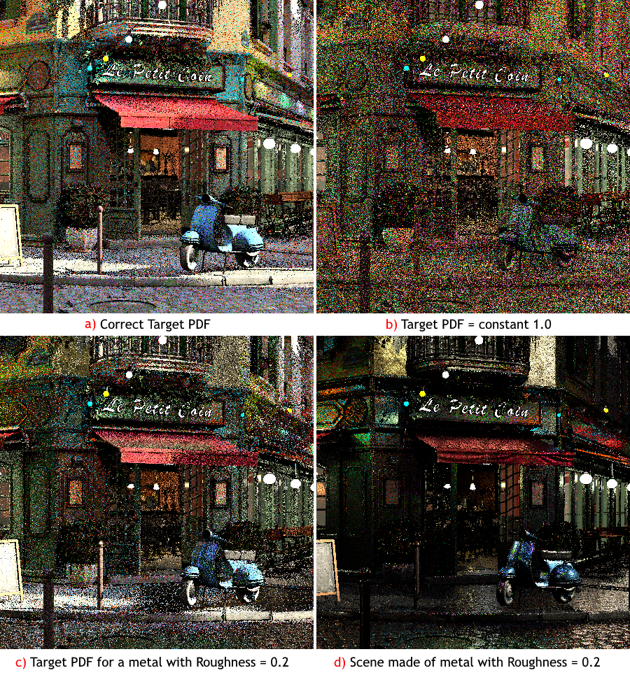
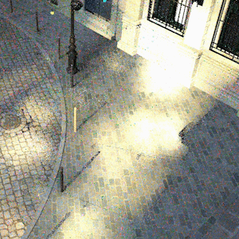
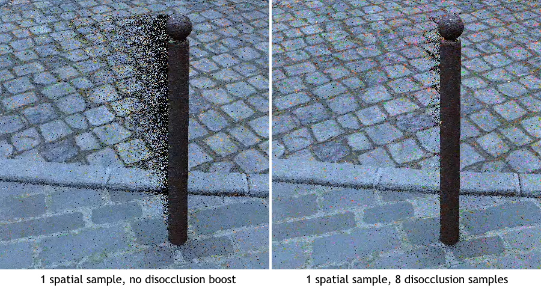
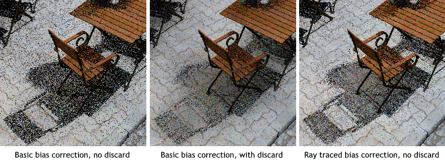

# Dealing with Noise and Bias

Reducing the noise that comes with sampled lighting is the entire point of ReSTIR and RTXDI. There are many parameters in the resampling passes that affect the noise levels and performance, and there are a few critical pieces of functionality that must be implemented right in order to ensure adequate ReSTIR performance.

## Target PDF

Implementing a good target PDF function for surfaces is the most important thing in an RTXDI integration. The target PDF should be proportional to the outgoing radiance of the final material BSDF for the provided light sample, or approximate it as closely as possible. If the PDF is wrong, no amount of samples will get rid of the noise, because the algorithm will essentially pick the lights for a wrong, perhaps nonexistent, surface. However, as long as the PDF does not have any zeros where it should be nonzero, the results will be unbiased and accumulate to a correct picture given sufficient time, no matter how wrong the PDF actually is. For example, a constant 1.0 is a valid unbiased PDF, just a very poor one.

The target PDF is defined as `RAB_GetLightSampleTargetPdfForSurface` in the bridge. The sample application just evaluates the final BRDF in that function, which is almost ideal. The only better solution would be to include the visibility term between the surface and the light sample, but that usually involves ray tracing, which makes it impractical: the PDF might be evaluated dozens of times per pixel per frame. Still, if some sort of visibility approximation is available, consider using it, as long as it is conservative - meaning it doesn't say "occluded" for lights that are actually visible.

An illustration for the effect that the target PDF makes on the final sampled image is shown below. 

Image (a) shows a rendering of the Bistro scene with the correct target PDF proportional to the actual BRDF. Image (b) shows the same scene with a PDF that is constant 1.0, meaning it is equally likely to select the sun light as it is to select a tiny emissive triangle far away. Image (c) shows the scene with a PDF that assumes that every material is fully metallic and has a roughness of 0.2, which makes the renderer prefer lights that are somewhere around the reflected direction, instead of anywhere around a diffuse surface. Image (d) shows the scene that actually has all materials replaced by metals with a roughness of 0.2, to illustrate what ReSTIR is trying to render on image (c).

## Stages of importance resampling

RTXDI achieves noise reduction by applying a sequence of importance sampling and importance resampling (RIS) passes. Put simply, importance resampling is a process that filters a large number of samples and selects a smaller number of samples that are distributed according to a PDF different from one that was used to generate the original set of samples. The new PDF is called "target PDF", and the old one is called "source PDF". It is useful in situations when the target PDF is difficult or impractical to sample directly, but the source PDF is easy to sample and can be used to generate a lot of samples for cheap. For more information on RIS, refer to the paper called "[Importance Resampling for Global Illumination](https://citeseerx.ist.psu.edu/viewdoc/download?doi=10.1.1.70.139&rep=rep1&type=pdf)" by J. Talbot et al.

Talbot summarizes RIS as PDF interpolation: "We can view M, the number of samples, as a distribution interpolation variable. When M = 1, Y (the resulting samples) is distributed according to p (source PDF). As M approaches infinity, the distribution of Y approaches g (target PDF)." Paraphrasing that, the more source samples we process to produce a single target sample, the closer these samples will be distributed to the target PDF, therefore, we'll get less noisy signal.

The two main use cases for importance resampling in RTXDI are when the *target PDF* is proportional to a surface's reflected radiance, and the *source PDF* is either proportional to the light's emissive power or is coming from a previous resampling step. The former case is used in the initial sampling pass; the latter one is used in the subsequent spatio-temporal resampling pases.

The initial sampling pass has a straightforward way to control the output noise: specify the number of samples taken from each strategy. There are separate sample counts for local lights (either importance sampled or not), for infinite lights, for the environment map, and for ReGIR where it's available. The more samples are taken, the better the results, but the noise reduction is linear, which means the initial sampling pass alone won't produce a good enough picture for a large number of lights in real-time constraints. It's important, however, to have enough initial samples to avoid boiling that appears when spatio-temporal reuse is applied to a very noisy, sparse signal. Using ReGIR can help with the boiling situation in large scenes with multiple rooms or similarly separated locations. An example of this boiling is shown on the animation below, which was rendered by applying uniform sampling to an environment map with a very bright sun.

The temporal and spatial resampling passes, or a combined version of those - the spatio-temporal pass, are crucial to noise reduction. Using temporal resampling makes the number of light samples evaluated per pixel increase linearly over time, and adding spatial resampling on top changes that sample count function to an exponential one. The more spatial samples you use, the higher is the base of the exponent, and the faster the noise will fade. But increasing the number of spatial samples also results in reduced performance, and using many samples is not necessary in converged areas - typically, 1-3 samples are sufficient. Many spatial samples are useful mostly in areas of disocclusion, and the process of increasing their count is called "disocclusion boost". The `numDisocclusionBoostSamples` parameter of the spatial and spatio-temporal resampling passes controls how many samples to take in areas that do not have sufficient history length, to help those areas converge faster. 

The effectiveness of disocclusion boost is illustrated on the image below. It shows the same scene location captured when the camera is strafing from right to left, making a portion of the ground appear from behind the pole on every frame.

## Denoiser friendliness 

Modern spatio-temporal denoisers expect the input noisy signal to have certain properties. The signal should obviously have as low variance as possible to avoid lagging or over-blurring, but at the same time it should converge as quickly as possible when accumulated. The convergence requirement means that all relevant lighting components for a surface should be sampled in the fewest number of frames. For traditional sampling schemes like BRDF sampling or regular NEE, driving the sample generation with blue noise is a reasonable solution, and it achieves a good spatial distribution of samples as well. For ReSTIR, it's not so simple, an RNG (Random Number Generator) doesn't determine all characteristics of the output signal.

If a single temporal resampling pass is applied, the output noisy signal will appear fairly stable. Too stable, in fact, and a temporal denoiser will not have enough temporal variation to operate effectively. The denoiser will see that the signal in each pixel has low temporal variance, and decide that it doesn't need to be blurred, so the result will be blotchy. The blotches will also fade in and out slowly, together with the noisy signal. Using a shorter history in ReSTIR helps increase temporal variation, but also increases noise. Another problem with using a single temporal pass is that in motion, the light samples tend to stick together and form clusters of bright pixels, which is even more confusing for the denoiser. These situations are illustrated on the animation below.

Adding a spatial resampling pass after temporal resampling improves the noise patterns significantly. One spatial sample helps break up the stable patterns and bright clusters, add enough variation for the denoiser to be effective. Two spatial samples improve the signal even more and reduce noise.

## Bias

The term "bias" refers to cases when the sampled signal doesn't correctly approximate the full integral, i.e. when increasing the number of samples doesn't make the sampled signal converge to the right answer. In ReSTIR, bias primarily comes from spatiotemporal reuse, that is, when a surface reuses a light sample from another surface that has a different target PDF for the same light sample. That type of bias is visible as darkening around geometric discontinuities. Other types of bias come from visibility reuse: discarding samples after final shading when they are invisible, and reusing the visibility term for the same light sample between different surfaces. These types are visible as darkening or brightening around edges of shadows.

Bias propagates through spatio-temporal reuse, which means the more old reservoirs are included in the solution for a pixel, the more biased it becomes. It's easy to observe that using more spatial samples leads to a stronger bias, and the fused spatio-temporal resampling approach produces more biased results than separate temporal and spatial passes, because it sources all its additional samples from the previous frame.

### Spatio-temporal reuse bias

RTXDI has three modes for handling the spatio-temporal reuse bias, controlled by the `biasCorrectionMode` parameter of the resampling passes. The lowest setting, `RTXDI_BIAS_CORRECTION_OFF`, uses the simplest form of reservoir normalization, `1/M`. This mode is the fastest, but it also produces the most biased results, which can even lead to temporary brightening in disocclusion areas. The medium-quality setting, `RTXDI_BIAS_CORRECTION_BASIC`, applies MIS-like (Multiple Importance Sampling) normalization that involves computing the target PDF of the selected light sample for each of the source reservoirs used in resampling. While this mode makes the results more stable, it doesn't correct the bias completely. Complete correction is achieved with the `RTXDI_BIAS_CORRECTION_RAY_TRACED` mode, which, in addition to computing the target PDF for each source reservoir, also verifies that the sample could have been produced by that reservoir. The verification is performed using ray tracing, specifically the `RAB_GetConservativeVisibility` function, which means there is a ray traced for each temporal and spatial sample taken.

One important aspect of bias correction is using correct temporal data. Since the bias correction math needs to know how likely the selected sample was to be generated for the original surface, it needs to compute that probability using the surface data, light data, and visibility data from the previous frame. Previous frame surface data should be easy to get by keeping the previous G-buffer around. Previous frame light data could be more difficult as it requires storing all the light data from the previous frame and computing an index mapping from the current frame to the previous frame. Finally, previous frame visibility requires keeping the previous frame TLAS and BLAS for deformable or dynamic meshes, and in case visibility can be affected by materials such as alpha masks, also keeping the previous material and UV data. Failing to use correct temporal data will result in darkening bias when things are moving, which might be an acceptable compromise to reduce implementation complexity.

### Visibility reuse bias

The other two sources of bias - discarding invisible samples and visibility reuse - cannot be corrected, but these features are still useful when completely unbiased results are not necessary, for example, in games. Discarding invisible samples after the final shading pass is useful because it can significantly reduce noise in areas that are near the edge of the shadow cast by a powerful light. Note that a similar effect can be achieved by using ray traced bias correction, which is unbiased but more expensive. See the image below for a comparison of these techniques.

Final visibility reuse is an optimization that significantly reduces the number of rays traced for final shading. The renderer stores the final visibility as color in the reservoir, and that visibility is copied around when the reservoir is reused. When the final visibility is copied, the reservoir tracks the distance between the original location of the surface that generated the visibility term and the reservoir's current location, and the age of the visibility term, in frames. During final shading, the renderer can query if the reservoir has stored visibility and if it hasn't moved too far, and if everything is good, the stored visibility can be used instead of tracing a new ray. In our tests, this type of reuse has been shown to reduce the number of final visibility rays to 30% of its original value, with negligible visual difference.

